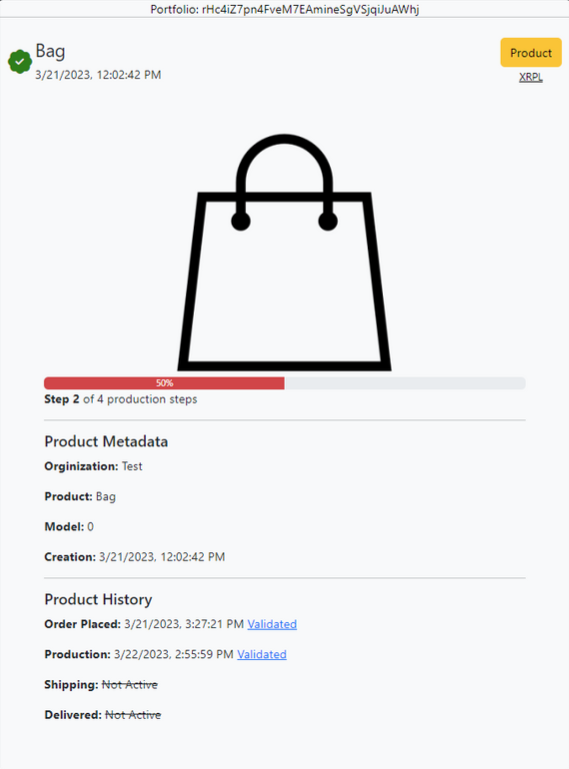

# What is TraceXRPL (WIP)

## Introduction

TraceXRPL allows manufacturers to document the lifecycle of their products in an immutable, tamper-proof way. Utilizing NFTs, we mirror physical products on the XRPL, record product information via the URI, and connect them to other NFTs that are minted as the production stage advances. This inherently authenticates products, creates producer-to-consumer trust, and eliminates the susceptibility of supply chain misinformation.

## Use Cases

### Use Case 1

A consumer purchases, or preorders a bag online, and with their receipt they are able to claim an NFT that represents this bag. As the company produces the bag, each stage of production is represented & minted as an NFT that is connected to the consumers bag/NFT.  Using their NFTokenID, the consumer can then view their product history and authenticity online. 

Populated by data from the XRPL, Product Metadata and Product History are stored as NFTs and can **not** be changed. 

### Use Case 2

Other luxury products, such as watches, have communities of enthusiasts and professionals that still have trouble verifying if products are real. Even though some watch manufacturers have serial number lookups, the serial number can be taken from a real model and put on the fake. With TraceXRPL, the products serial number is linked to an NFT, the production lifecycle recorded as NFTs, and only one NFT will have the matching serial number. On top of this, the owner of the watch will own it digitally, further proving the watch is authentic.

## Features

### Current Features
1. Ability to mint a product as an NFT
2. Add custom production steps and update a products production status via NFTs
3. NFTs are all connected and easily queried

### To Do List
1. Further develop on-ledger storage to store more metadata about a product, such as a watches face, band, etc.
2. Finish creating API (most important endpoint will return JSON of all on-chain/off-chain data about a product)
3. Allow other wallets to claim product NFT
4. Create business sign-in & create a real UI
5. Shopify App and WordPress Plugin
